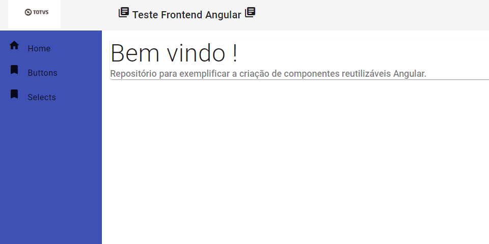
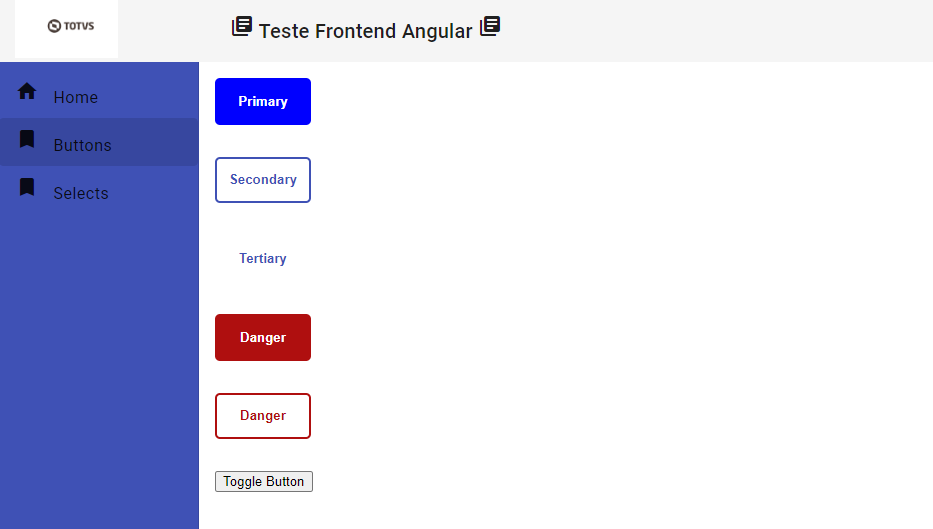
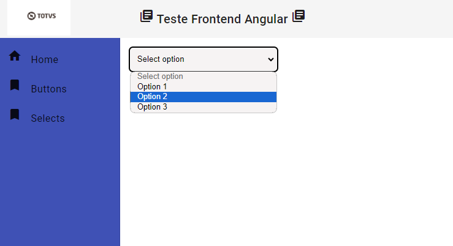

# Desafio Angular Frontend

Repositório criado especificamente para o desafio Frontend Angular Junior

## Proposta

O desafio consiste na criação de 2 componentes reutilizáveis, um de Botão e um de Seletor

## Layout

